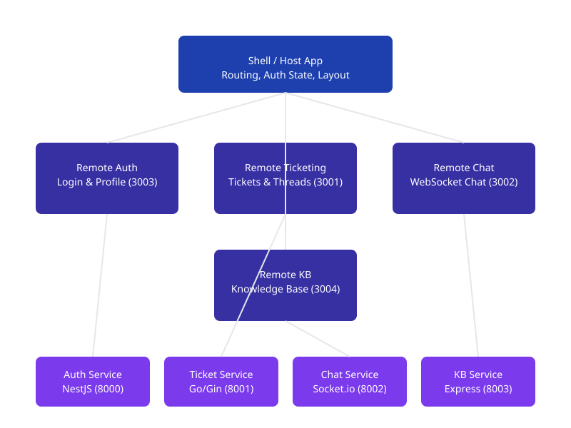

# Micro-Frontend Customer Portal & Helpdesk

> An enterprise-grade micro-frontend architecture for customer support portal with independent deployment capabilities.



## 📋 Overview

This repository implements a **Micro-Frontend Customer Portal & Helpdesk** system using:

- **Module Federation (Vite)** for runtime micro-frontend composition
- **Microservices architecture** backend (NestJS + Go + Node.js)
- **Monorepo** management via pnpm workspaces + Turborepo
- **PostgreSQL** database with indexed schemas
- **Docker** multi-stage builds & docker-compose for local dev
- **CI/CD** with independent remote deployments to S3/CloudFront

## 🏗️ Architecture

### System Diagram

```
                      +----------------------------------+
                      |       Shell / Host App           |
                      | (Routing, Auth State, Layout)    |
                      +----------------------------------+
                                       |
        +------------------------------+------------------------------+
        |                              |                              |
+-------v-------+              +-------v-------+              +-------v-------+
|  Remote 1:    |              |  Remote 2:    |              |  Remote 3:    |
| Auth & User   |              | Ticketing     |              | Real-Time     |
| Profile       |              | System        |              | Live Chat     |
+---------------+              +---------------+              +---------------+

        +------------------------------+
        |  Remote 4:                   |
        | Knowledge Base / FAQ         |
        +------------------------------+
```

### Micro-Frontend Applications

| App | Port | Description | Key Features |
|-----|------|-------------|--------------|
| **Shell Host** | 3000 | Root container | Global routing, auth state, theme management |
| **Remote Auth** | 3003 | Authentication | Login, register, profile settings, session management |
| **Remote Ticketing** | 3001 | Ticket engine | Create/filter tickets, priority-based views, threads |
| **Remote Chat** | 3002 | Live chat | Real-time WebSocket, typing indicators, notifications |
| **Remote KB** | 3004 | Knowledge base | Article search, ratings, categories, FAQ |

### Backend Microservices

| Service | Port | Tech Stack | Description |
|---------|------|------------|-------------|
| **Auth Service** | 8000 | Node.js / NestJS | OAuth2, JWT, RBAC, password management |
| **Ticket Service** | 8001 | Go / Gin | High-throughput ticket processing |
| **Chat Service** | 8002 | Node.js / Socket.io | WebSocket real-time messaging |
| **KB Service** | 8003 | Node.js / Express | Article indexing, search, ratings |

### Shared Packages

| Package | Description |
|---------|-------------|
| `@mf-enterprise/ui-components` | Shared React component library (Radix UI + Tailwind) |
| `@mf-enterprise/event-bus` | Cross-app event communication (mitt-based pub/sub) |
| `@mf-enterprise/ts-config` | Shared TypeScript configurations |
| `@mf-enterprise/eslint-config` | Shared ESLint rules |
| `@mf-enterprise/types` | Shared TypeScript type definitions |

## 🚀 Quick Start (Zero-Config)

### Prerequisites

- **Node.js** >= 20
- **pnpm** >= 9 (`npm install -g pnpm`)
- **Docker** & **Docker Compose** (for local infra)

### One-Command Setup

```bash
# Start all infrastructure services (PostgreSQL, Redis, Nginx)
docker-compose up -d

# Install all dependencies
pnpm install

# Run all services in development mode
pnpm dev
```

The entire system will be available at `http://localhost:3000`.

### Individual Service Startup

```bash
# Shell host only
pnpm --filter shell-host dev

# Individual micro-frontend
pnpm --filter remote-auth dev
pnpm --filter remote-ticketing dev
pnpm --filter remote-chat dev
pnpm --filter remote-knowledgebase dev
```

## 🐳 Docker Deployment

```bash
# Build and start all services
docker-compose up -d

# View logs
docker-compose logs -f

# Stop services
docker-compose down
```

## 🏗️ Development Scripts

| Command | Description |
|---------|-------------|
| `pnpm dev` | Start all services in dev mode |
| `pnpm build` | Build all packages and apps |
| `pnpm test` | Run all unit tests |
| `pnpm lint` | Lint all code |
| `pnpm typecheck` | TypeScript type checking |
| `pnpm clean` | Clean build artifacts |
| `pnpm deploy` | Full deployment pipeline |

### Per-Package Commands

```bash
pnpm --filter shell-host test
pnpm --filter auth-service build
pnpm --filter remote-ticketing lint
```

## 🧪 Testing

### Unit Tests

```bash
pnpm test
pnpm --filter @mf-enterprise/event-bus test
```

### E2E Tests (Playwright)

```bash
npx playwright install
cd tests/e2e
pnpm test
```

## 📊 Performance Audit

### Google Lighthouse Targets

| Metric | Shell App Target | Score |
|--------|-----------------|-------|
| Performance | > 90 | 🟢 |
| Accessibility | > 90 | 🟢 |
| Best Practices | > 90 | 🟢 |
| SEO | > 80 | 🟢 |

### Bundle Size Budget

| Remote | Bundle Limit | JS Isolation |
|--------|-------------|--------------|
| Shell Host | < 150 KB | ✅ |
| Auth Remote | < 100 KB | ✅ |
| Ticketing Remote | < 120 KB | ✅ |
| Chat Remote | < 80 KB | ✅ |
| KB Remote | < 90 KB | ✅ |

## 🔧 Configuration

### Environment Variables

#### Shell Host

```bash
VITE_API_URL=http://localhost:8000/api
VITE_REMOTE_AUTH=http://localhost:3003/assets/remoteEntry.js
VITE_REMOTE_TICKETING=http://localhost:3001/assets/remoteEntry.js
VITE_REMOTE_CHAT=http://localhost:3002/assets/remoteEntry.js
VITE_REMOTE_KB=http://localhost:3004/assets/remoteEntry.js
```

### Cross-Remote Communication

```typescript
// Emit event from Remote App
import { eventBus } from "@mf-enterprise/event-bus";
eventBus.emit("ticket:created", { ticket });

// Listen for events in Shell
eventBus.on("ticket:created", ({ ticket }) => {
  console.log("New ticket:", ticket);
});
```

### JWT Token Management

- JWT stored in HTTP-only cookie or memory state at Shell level
- Tokens forwarded to Remote Apps via props injection
- Automatic refresh token handling

## 🔄 CI/CD Pipeline

```
CI Pipeline (ci-pipeline.yml)
  ├── Lint & Typecheck
  ├── Build & Test (per-service)
  ├── Security Audit
  └── E2E Tests

Independent Deployment (deploy-*.yml)
  Git Push → GitHub Actions
    ├── Unit Tests
    ├── Build Asset
    ├── Upload to S3 CDN
    └── Purge CloudFront Cache
```

## 📦 Repository Structure

```text
micro-frontend-enterprise/
├── apps/
│   ├── shell-host/
│   ├── remote-auth/
│   ├── remote-ticketing/
│   ├── remote-chat/
│   └── remote-knowledgebase/
├── packages/
│   ├── ui-components/
│   ├── event-bus/
│   ├── ts-config/
│   └── eslint-config/
├── services/
│   ├── auth-service/
│   ├── ticket-service/
│   ├── chat-service/
│   └── knowledge-service/
├── shared/types/
├── tests/e2e/
├── .github/workflows/
├── docker/
├── docker-compose.yml
├── turbo.json
├── pnpm-workspace.yaml
└── package.json
```

## 📖 API Documentation

### Auth Service

| Method | Endpoint | Description |
|--------|----------|-------------|
| POST | `/api/auth/login` | Login |
| POST | `/api/auth/register` | Register |
| POST | `/api/auth/refresh-token` | Refresh token |
| GET | `/api/auth/me` | Get current user |
| POST | `/api/auth/logout` | Logout |

### Ticket Service

| Method | Endpoint | Description |
|--------|----------|-------------|
| GET | `/api/tickets` | List tickets |
| POST | `/api/tickets` | Create ticket |
| GET | `/api/tickets/:id` | Get ticket |
| PUT | `/api/tickets/:id` | Update ticket |
| GET | `/api/tickets/stats` | Dashboard stats |
| GET | `/api/tickets/:id/threads` | Ticket threads |
| POST | `/api/tickets/:id/threads` | Add thread |

### Chat Service (Socket.io)

| Event | Direction | Description |
|-------|-----------|-------------|
| `room:join` | C→S | Join chat room |
| `message:send` | C→S | Send message |
| `message:received` | S→C | New message |
| `notification` | S→C | System notification |
| `typing` | Bidirectional | Typing indicator |

### Knowledge Base

| Method | Endpoint | Description |
|--------|----------|-------------|
| GET | `/api/categories` | List categories |
| GET | `/api/articles` | List articles |
| GET | `/api/articles/:slug` | Get article |
| POST | `/api/articles/rate` | Rate article |
| GET | `/api/search?q=...` | Search articles |

## 🛠️ Tech Stack

| Layer | Technology |
|-------|-----------|
| Frontend | React 18, TypeScript, Vite, Tailwind CSS |
| Micro-Frontend | Vite Module Federation, React Router, Zustand |
| Backend | NestJS, Go/Gin, Node.js/Socket.io, Express |
| Database | PostgreSQL, Redis |
| State | Zustand, @tanstack/react-query |
| UI | Radix UI, lucide-react |
| Package Manager | pnpm Workspaces |
| Build/CI | Turborepo, GitHub Actions |
| Containerization | Docker, Docker Compose, Nginx |
| Deployment | AWS S3, CloudFront |
| Testing | Vitest, Playwright, Jest |

## 📜 License

MIT
